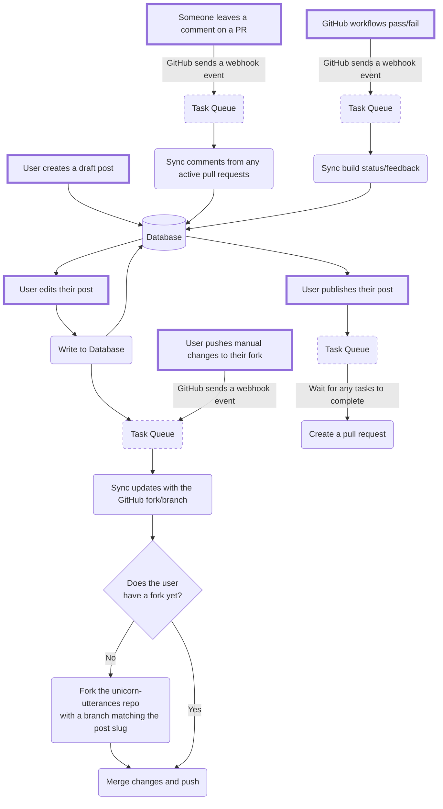

# Unicorn Utterances CMS

This provides a managed post editing/review flow for the [Unicorn Utterances](https://unicorn-utterances.com) website.

The aim is to enable a post draft, review, and revision workflow without needing to clone the repo or wait for build previews.

We chose to build our own solution instead of integrating with existing options because:

- We want to published posts to be stored in Git rather than a database

- UU's markdown integrations create additional complexity for editors and real-time previews

- Existing options are not flexible enough to provide an intuitive experience while supporting our use case

Here's a rough flow chart of the planned functionality:



## Getting Started

Prerequisites:
- [IntelliJ IDEA](https://www.jetbrains.com/idea/)
- [Java 21](https://jdk.java.net/21/) (can also be installed via IntelliJ: File -> Project Structure -> Project -> SDK)
- [Node 20](https://nodejs.org/en/download)
- pnpm
- [Docker](https://www.docker.com/get-started/)

To start the postgres database:
```sh
cp .env.example .env
docker compose up --wait
```

To run the API server:
```sh
cd api
./gradlew run # (or use the Run button in IntelliJ)
```

To start the client:
```sh
cd client
pnpm install
pnpm run dev
```
